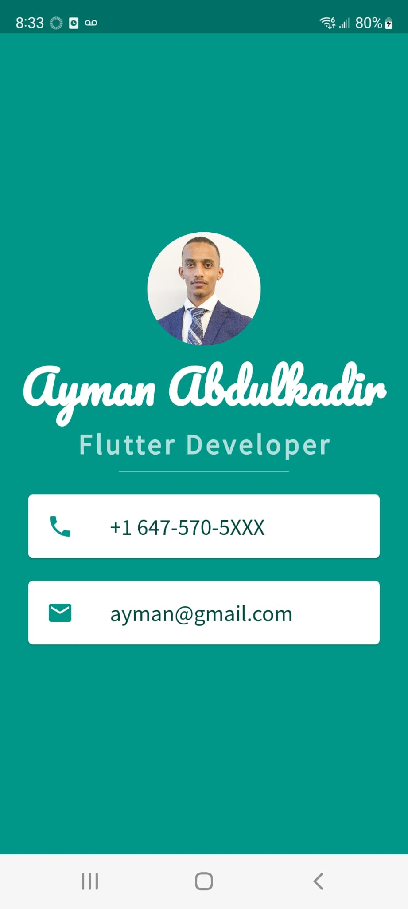

## Mi-card Project
# Mi Card is a personal business card

This project allowed me to explore the following:
<ul>
  <li>How to create Stateless Widgets</li>
<li> What is the difference between hot reload and hot refresh and running an app from cold</li>
<li> How to use Containers to lay out your UI</li>
<li> How to use Columns and Rows to position your UI elements</li>
<li> How to add custom fonts</li>
<li> How to add Material icons</li>
<li> How to style Text widgets</li>
<li> How to read and use Flutter Documentation</li>
</ul>

